### 🚀 Full-Stack Developer • Mobile App Developer  
**B.Tech CSE Student** | Loves building, designing, and breaking things to learn.

🌐 **Portfolio:** <a href="https://bbinxx.vercel.app/" target="_blank">bbinxx.vercel.app</a>

---

## 😎 Who Am I?

- B.Tech CSE undergrad who treats coding like a survival skill  
- Backend with **Node.js + Express**, frontend with **Next.js**  
- Flutter dev who enjoys smooth UIs & hunting bugs  
- Graphic design enjoyer — pixels deserve respect  
- Custom ROM enthusiast — flashing phones is a lifestyle  

> *“If it works without explanation, I don’t touch it. Sacred code.”*

---

## 🔧 Tech Stack

### 🧠 Languages

  

---

### 🎨 Frontend & Mobile

  

---

### ⚙️ Backend & APIs

  

---

### 🗄️ Databases

  

---

### ☁️ Deployment & Platforms

  

---

### 🛠️ Tools & OS

  

---

### 🎨 Design & Creative

  

---

## 📚 Currently Learning

- Writing cleaner backend architecture (future-me will thank me)  
- Flutter animations that don’t feel like PowerPoint  
- MongoDB indexing — because `.find()` isn’t a strategy  
- Deployments that don’t cause production anxiety  

> **Learning split:** 60% docs • 30% debugging • 10% music

---

## 📊 GitHub Stats

  

---

## 📊 Developer Metrics

  

---

## 🎧 Currently Listening To

  

> *Music doesn’t fix bugs — but it makes the pain aesthetic.*

---

⭐ **If something here impressed you, confused you, or made you smile — drop a star.**  
GitHub’s version of a respectful head nod 🤝

